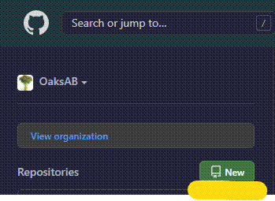
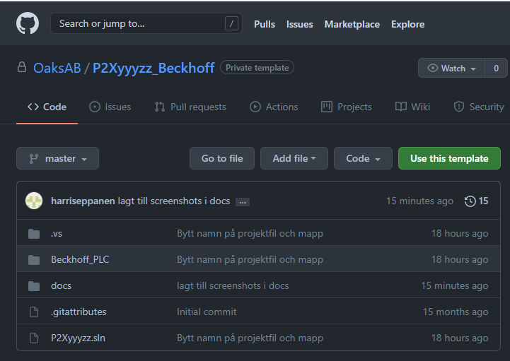
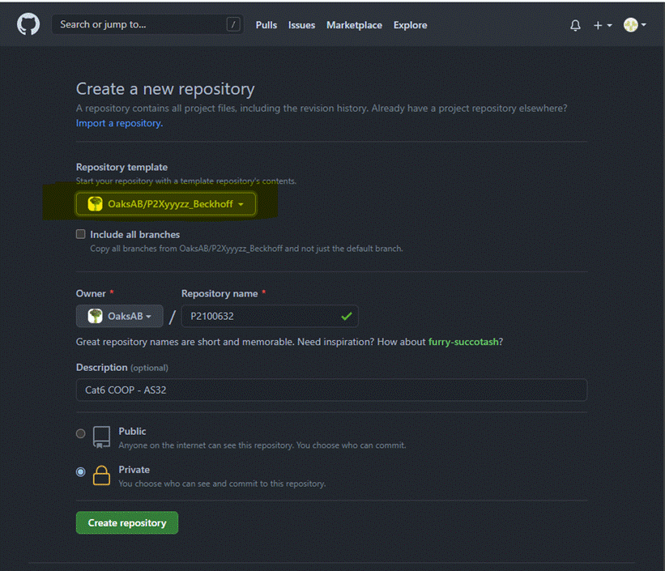
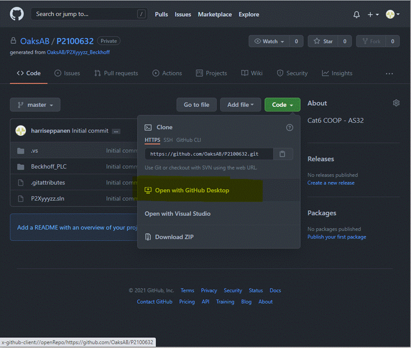

# !!OBS!! Om denna text ligger kvar i ditt projekt efter att du skapat det från mallen, så har inte den automatiska rensningen utförts. Gör följande:
Uppdatera sidan efter en minut och se om texten är kvar (ibland kan rensningen ta nån minut). Om den är kvar: 
Klicka på "Actions" 
Välj "Cl" under "Workflows" 
Klicka på "Run workflow" och välj "Run workflow" 
Vänta ett tag, nu ska "Template cleanup" utförts på din repo och du kan klona hem projektet och börja jobba!

# 1. Från Dashboard i vår organisation ( https://github.com/orgs/OaksAB/dashboard) trycker man på New-knappen. Alternativt fungerar också "Use this template" om man befinner sig på sidan för mallens repository.

# 2. Välj alternativet ”OaksAB/P2Xyyyzz_Beckhoff” under Repository template. Fyll i din info enligt nedan och tryck sedan på ”Create Repository”.

 
# 3. Nu är ett nytt grundprojekt skapad i en ny repository. Detta går nu enkelt att klona ner med Github desktop, antingen genom att öppna Github desktop och klona därifrån men också genom att klicka på den gulmarkerade länken nedan 😊

